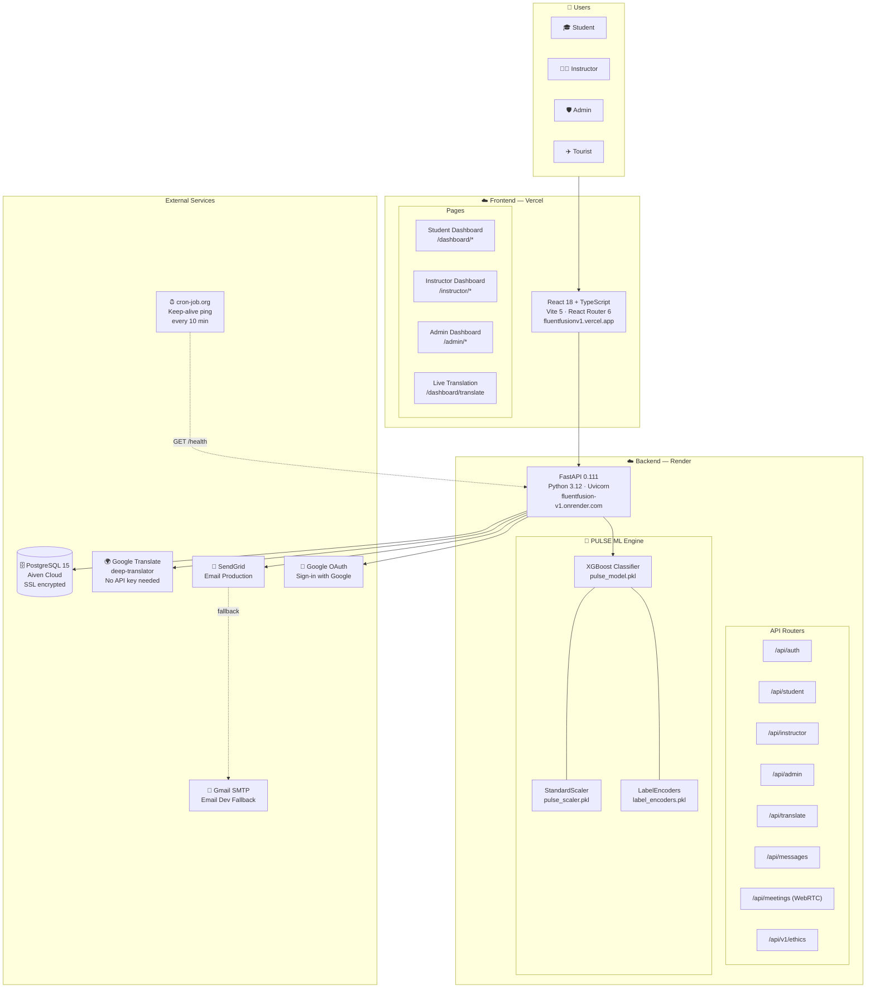
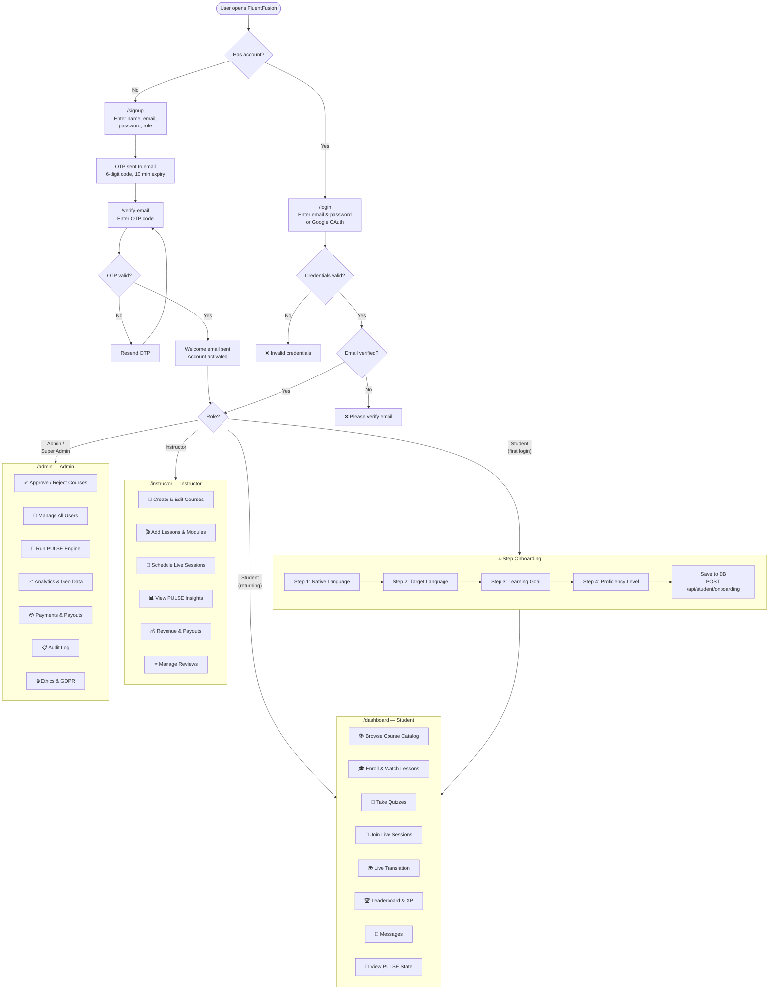
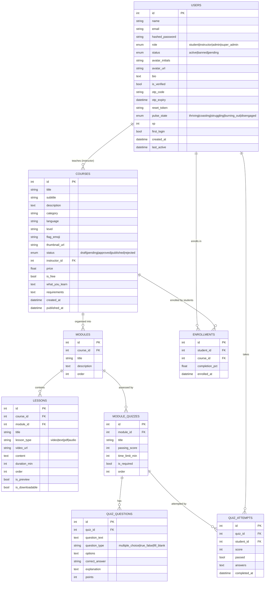
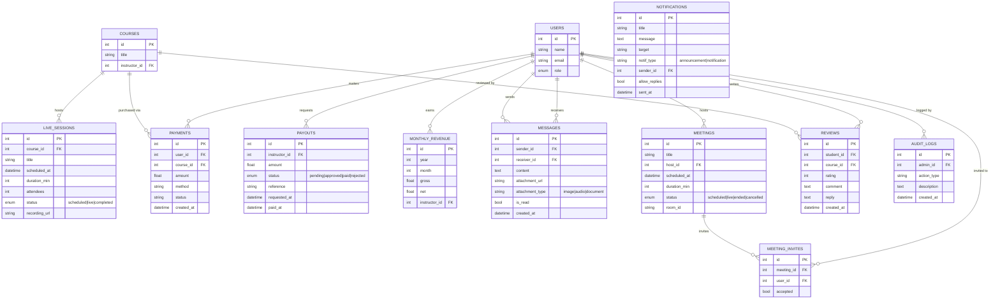
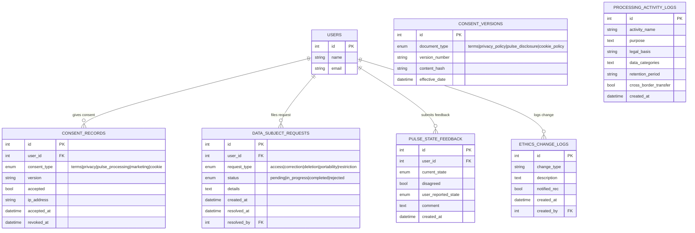
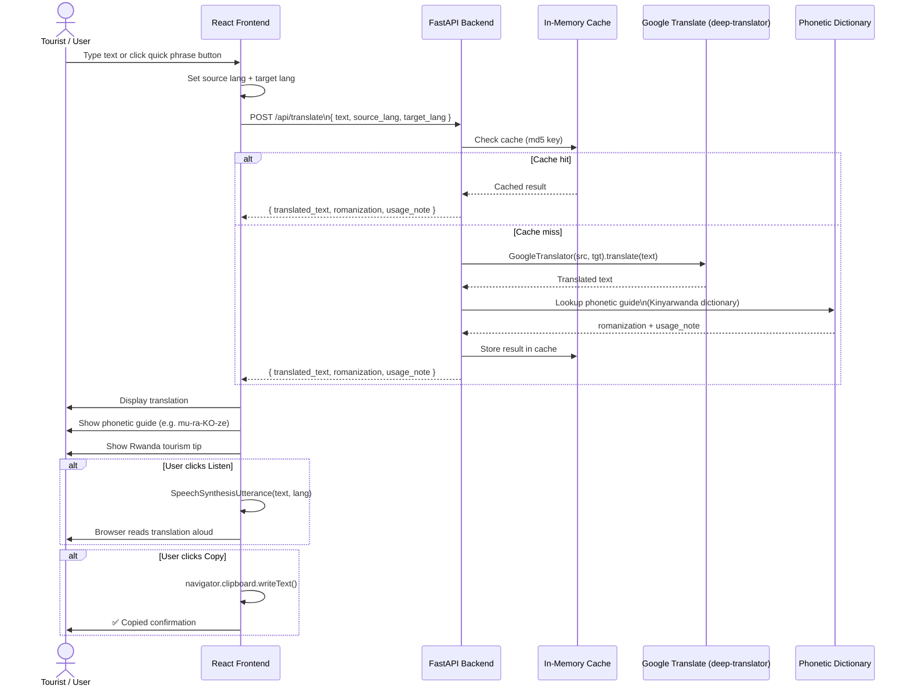

# 📐 FluentFusion — System Diagrams

> Render each diagram at [mermaid.live](https://mermaid.live) → Actions → PNG → insert into Google Docs at 16cm width.

---

## 1. 🏗️ System Architecture Diagram

---

## 2. 🔄 Flowchart — Complete User Journey

---

## 3. 👤 Use Case Diagram — All Actors

```mermaid
flowchart LR
    subgraph Actors["Actors"]
        ST(["🎓 Student"])
        IN(["👨‍🏫 Instructor"])
        AD(["🛡️ Admin"])
        SA(["🔑 Super Admin"])
        SY(["⚙️ System"])
    end

    subgraph UC_AUTH["Authentication"]
        A1["Register with email"]
        A2["Login with email/password"]
        A3["Login with Google OAuth"]
        A4["Verify email via OTP"]
        A5["Reset forgotten password"]
    end

    subgraph UC_ST["Student Features"]
        B1["Complete 4-step onboarding"]
        B2["Browse course catalog"]
        B3["Enroll in a course"]
        B4["Watch video lessons"]
        B5["Take quizzes"]
        B6["Join live sessions (WebRTC)"]
        B7["Use Live Translation"]
        B8["View XP & leaderboard"]
        B9["Track PULSE state"]
        B10["Send & receive messages"]
        B11["Speaking practice"]
        B12["Flashcards & daily challenge"]
        B13["Manage GDPR data rights"]
    end

    subgraph UC_IN["Instructor Features"]
        C1["Create & edit courses"]
        C2["Add lessons & modules"]
        C3["Create quizzes"]
        C4["Schedule live sessions"]
        C5["View student roster"]
        C6["View PULSE engagement insights"]
        C7["View revenue & request payout"]
        C8["Reply to student reviews"]
        C9["Send messages to students"]
    end

    subgraph UC_AD["Admin Features"]
        D1["Approve or reject courses"]
        D2["Manage all platform users"]
        D3["Ban or unban users"]
        D4["Run PULSE ML engine"]
        D5["View analytics & geo data"]
        D6["Manage payments & payouts"]
        D7["View audit log"]
        D8["Send platform notifications"]
        D9["Manage platform settings"]
        D10["Oversee ethics & compliance"]
    end

    subgraph UC_SA["Super Admin Only"]
        E1["Create admin accounts"]
        E2["Delete admin accounts"]
    end

    subgraph UC_SYS["System Automated"]
        F1["Send OTP verification email"]
        F2["Send welcome email on signup"]
        F3["Send password reset email"]
        F4["Classify learner via PULSE ML"]
        F5["Keep-alive ping via cron-job.org"]
    end

    ST --> A1 & A2 & A3 & A4 & A5
    ST --> B1 & B2 & B3 & B4 & B5 & B6 & B7 & B8 & B9 & B10 & B11 & B12 & B13

    IN --> A1 & A2 & A3 & A4 & A5
    IN --> C1 & C2 & C3 & C4 & C5 & C6 & C7 & C8 & C9

    AD --> A2
    AD --> D1 & D2 & D3 & D4 & D5 & D6 & D7 & D8 & D9 & D10

    SA --> E1 & E2

    SY --> F1 & F2 & F3 & F4 & F5

    A1 -.triggers.-> F1
    A4 -.triggers.-> F2
    A5 -.triggers.-> F3
    D4 -.triggers.-> F4
```

---

## 4. 🔁 Sequence Diagram — Student Registration & Onboarding

```mermaid
sequenceDiagram
    actor U as Student
    participant FE as React Frontend
    participant API as FastAPI Backend
    participant DB as PostgreSQL (Aiven)
    participant EM as Email Service

    rect rgb(20, 30, 20)
        Note over U,EM: Step 1 — Registration
        U->>FE: Fill signup form (name, email, password, role)
        FE->>API: POST /api/auth/register
        API->>DB: SELECT user WHERE email = ?
        DB-->>API: Not found (email available)
        API->>DB: INSERT User (is_verified=false, otp_code=XXXXXX)
        DB-->>API: User created (id=N)
        API->>EM: send_otp_email(email, name, otp)
        EM-->>U: Email with 6-digit OTP code
        API-->>FE: { access_token, role, id }
        FE->>FE: Redirect → /verify-email
    end

    rect rgb(20, 20, 30)
        Note over U,EM: Step 2 — Email Verification
        U->>FE: Enter 6-digit OTP code
        FE->>API: POST /api/auth/verify-email { email, code }
        API->>DB: SELECT user WHERE email = ?
        DB-->>API: User record with otp_code
        API->>API: Validate code & check expiry
        API->>DB: UPDATE SET is_verified=true, otp_code=null
        API->>EM: send_welcome_email(email, name, role)
        EM-->>U: Welcome email
        API-->>FE: { message: "verified", role: "student" }
        FE->>FE: Redirect → /onboard/native-language
    end

    rect rgb(30, 20, 20)
        Note over U,FE: Step 3 — 4-Step Onboarding
        U->>FE: Select native language
        FE->>FE: Save to localStorage
        U->>FE: Select target language
        FE->>FE: Save to localStorage
        U->>FE: Select learning goal
        FE->>FE: Save to localStorage
        U->>FE: Select proficiency level
        FE->>API: POST /api/student/onboarding\n{ native_lang, learn_lang, goal, level }
        API->>DB: UPDATE users SET onboarding fields
        DB-->>API: OK
        API-->>FE: { message: "onboarding saved" }
        FE->>FE: Redirect → /dashboard
    end
```

---

## 5. 🔐 Sequence Diagram — JWT Authentication & Role Routing

```mermaid
sequenceDiagram
    actor U as User
    participant FE as React Frontend
    participant AC as AuthContext
    participant API as FastAPI Backend
    participant DB as PostgreSQL

    rect rgb(20, 30, 20)
        Note over U,DB: Login Flow
        U->>FE: Enter email & password → Submit
        FE->>API: POST /api/auth/login\n(form: username, password)
        API->>DB: SELECT user WHERE email = ?
        DB-->>API: User record
        API->>API: verify_password(plain, hashed)
        API->>API: Check is_verified = true
        API->>API: Check status != banned
        API->>API: create_access_token({ sub: user_id, role })
        API-->>FE: { access_token, role, name, id, is_first_login }
        FE->>AC: setToken() + setUser()
        AC->>AC: Persist to localStorage
    end

    rect rgb(20, 20, 30)
        Note over FE,FE: Role-Based Redirect
        FE->>FE: role = "student" → /dashboard
        FE->>FE: role = "instructor" → /instructor
        FE->>FE: role = "admin" → /admin
        FE->>FE: role = "super_admin" → /admin
    end

    rect rgb(30, 25, 10)
        Note over FE,DB: Protected API Request
        FE->>API: GET /api/student/dashboard\nAuthorization: Bearer <token>
        API->>API: decode JWT → user_id + role
        API->>DB: SELECT user WHERE id = user_id
        DB-->>API: User record
        API->>API: Verify role matches route guard
        API-->>FE: Dashboard data (JSON)
    end

    rect rgb(30, 10, 10)
        Note over U,FE: Token Expiry (1440 min)
        FE->>API: Request with expired token
        API-->>FE: 401 Unauthorized
        FE->>AC: clearToken()
        FE->>FE: Redirect → /login?reason=expired
    end
```

---

## 6. 🗄️ ERD — Core Tables (Users, Courses, Learning)

---

## 7. 🗄️ ERD — Payments, Sessions & Communication

---

## 8. 🗄️ ERD — Ethics & Compliance

---

## 9. 🌍 Sequence — Live Translation

---

## Summary

| # | Diagram | Page in Report |
|---|---|---|
| 1 | System Architecture | Implementation chapter |
| 2 | Flowchart — User Journey | System Design chapter |
| 3 | Use Case — All Actors | System Design chapter |
| 4 | Sequence — Registration & Onboarding | System Design chapter |
| 5 | Sequence — JWT Auth & Role Routing | System Design chapter |
| 6 | ERD — Core Tables | Database Design chapter |
| 7 | ERD — Payments, Sessions & Communication | Database Design chapter |
| 8 | ERD — Ethics & Compliance | Ethics chapter |
| 9 | Sequence — Live Translation | Implementation chapter |
