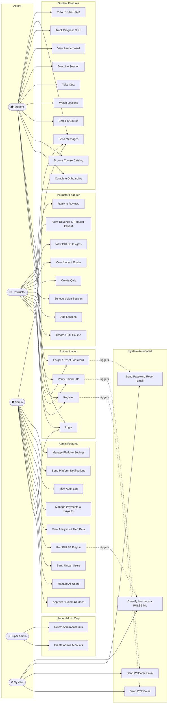
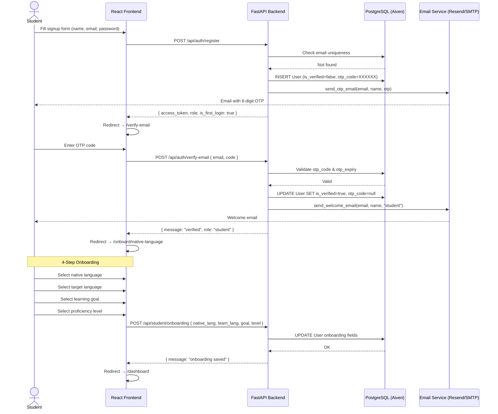
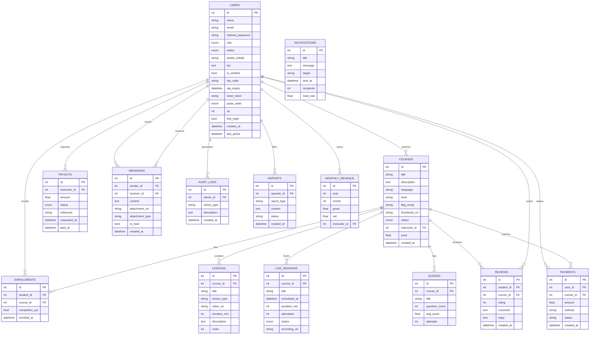
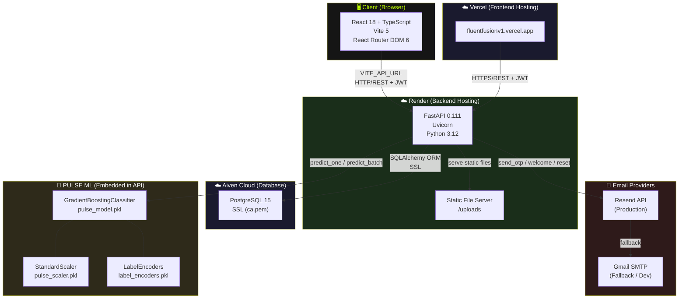
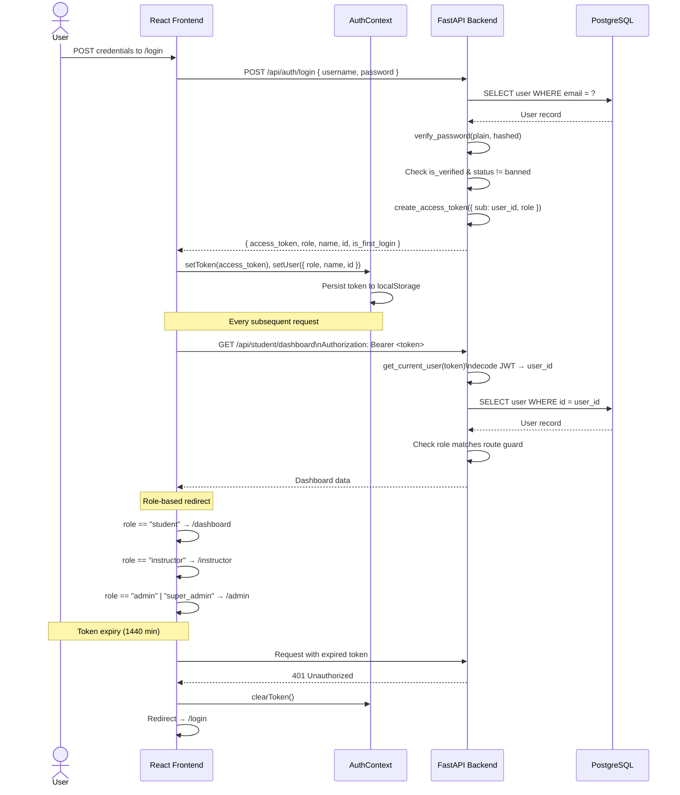

# 📐 FluentFusion — System Diagrams

> All diagrams are written in [Mermaid](https://mermaid.js.org/) syntax.
> Render them in GitHub, VS Code (Mermaid Preview), or [mermaid.live](https://mermaid.live).

---

## 1. 🔄 Flowchart — Full User Journey

```mermaid
flowchart TD
    A([User visits /]) --> B{Logged in?}
    B -- No --> C[Welcome Page]
    B -- Yes --> D{Role?}

    C --> E[/signup]
    C --> F[/login]

    E --> G[Register: name, email, password, role]
    G --> H[OTP sent via Email]
    H --> I[/verify-email — Enter 6-digit OTP]
    I --> J{OTP valid?}
    J -- No --> K[Resend OTP]
    K --> I
    J -- Yes --> L{Role?}

    F --> M[Enter credentials]
    M --> N{Valid?}
    N -- No --> O[Error: Invalid credentials]
    N -- Yes --> P{Email verified?}
    P -- No --> Q[Error: EMAIL_NOT_VERIFIED]
    P -- Yes --> L

    L -- student + first login --> R[Onboarding Step 1: Native Language]
    R --> S[Step 2: Target Language]
    S --> T[Step 3: Goal]
    T --> U[Step 4: Level]
    U --> V[POST /api/student/onboarding — save to DB]
    V --> W[/dashboard — Student Dashboard]

    L -- student + returning --> W
    L -- instructor --> X[/instructor — Instructor Dashboard]
    L -- admin / super_admin --> Y[/admin — Admin Dashboard]

    D -- student --> W
    D -- instructor --> X
    D -- admin --> Y

    W --> W1[Browse Catalog]
    W --> W2[Enroll in Course]
    W --> W3[Take Quiz]
    W --> W4[Join Live Session]
    W --> W5[View Leaderboard]
    W --> W6[Send Messages]

    X --> X1[Create / Edit Course]
    X --> X2[Manage Lessons]
    X --> X3[Schedule Live Session]
    X --> X4[View PULSE Insights]
    X --> X5[Request Payout]

    Y --> Y1[Approve / Reject Courses]
    Y --> Y2[Manage Users]
    Y --> Y3[Run PULSE Engine]
    Y --> Y4[View Revenue & Payments]
    Y --> Y5[Audit Log]
```

---

## 2. 👤 Use Case Diagram



---

## 3. 🔁 Sequence Diagram — Student Registration & Onboarding



---

## 4. 🗄️ Entity Relationship Diagram (ERD)



---

## 5. 🧠 PULSE ML Engine — State Machine

```mermaid
stateDiagram-v2
    direction LR

    [*] --> DataCollection : Student activity recorded

    state DataCollection {
        VLE_Clicks : VLE Click Logs\n(studentVle)
        Assessments : Assessment Scores\n(studentAssessment)
        Registration : Registration Dates\n(studentRegistration)
        Demographics : Demographics\n(studentInfo)
    }

    DataCollection --> FeatureEngineering : Aggregate & derive

    state FeatureEngineering {
        F1 : total_clicks
        F2 : active_days
        F3 : avg_clicks_per_day
        F4 : avg_score
        F5 : num_assessments
        F6 : days_to_first_submit
        F7 : withdrew_early
        F8 : studied_credits
        F9 : num_of_prev_attempts
        F10 : days_registered_before_start
    }

    FeatureEngineering --> Preprocessing : Scale + Encode

    state Preprocessing {
        Scaler : StandardScaler\n(pulse_scaler.pkl)
        Encoder : LabelEncoders\n(label_encoders.pkl)
    }

    Preprocessing --> Model : Scaled feature vector

    state Model {
        GBC : GradientBoostingClassifier\n(pulse_model.pkl)\nTrained on 32k OULAD students
    }

    Model --> Classification : Predict state + probabilities

    state Classification {
        S0 : 🚀 Thriving\n(Distinction)
        S1 : 😐 Coasting\n(Pass)
        S2 : 😓 Struggling\n(Fail)
        S3 : 🔥 Burning Out\n(Withdrawn late)
        S4 : 💤 Disengaged\n(Withdrawn early)
    }

    Classification --> DB : UPDATE users SET pulse_state = ?
    DB --> Dashboard : Displayed on Student / Instructor / Admin dashboards

    S0 --> S1 : Engagement drops
    S1 --> S2 : Scores decline
    S1 --> S3 : Activity declining
    S2 --> S4 : No activity
    S3 --> S4 : Withdrawal
    S4 --> S0 : Re-engagement
    S2 --> S0 : Improvement
```



---

## 6. 🏗️ System Architecture Diagram



---

## 7. 🔐 Sequence Diagram — JWT Authentication & Role-Based Access



---

## Summary

| # | Diagram | What it shows |
|---|---|---|
| 1 | Flowchart | Complete user journey from landing to all 3 dashboards |
| 2 | Use Case | All actors and their system interactions |
| 3 | Sequence | Student registration, OTP verification, and onboarding flow |
| 4 | ERD | Full database schema with all 14 tables and relationships |
| 5 | State Machine | PULSE ML pipeline from raw data to learner state classification |
| 6 | Architecture | Full system: frontend, backend, DB, email, ML, hosting |
| 7 | Sequence | JWT auth flow, role-based routing, and token expiry handling |
