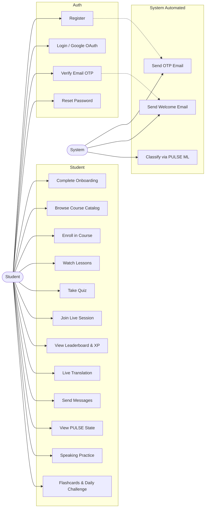
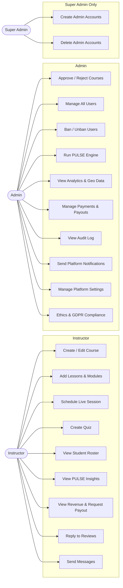
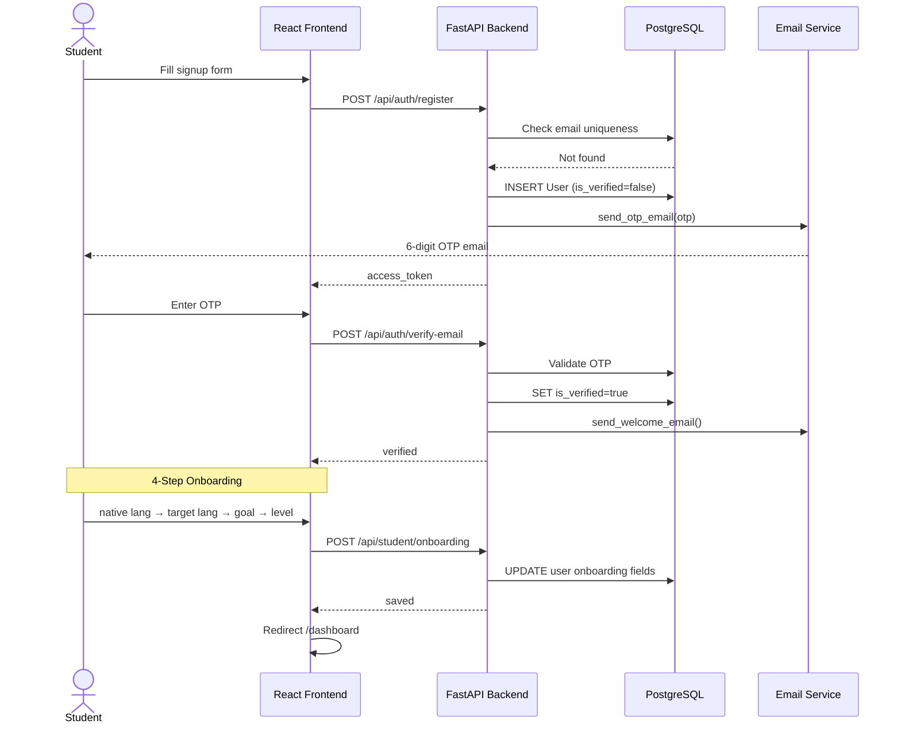
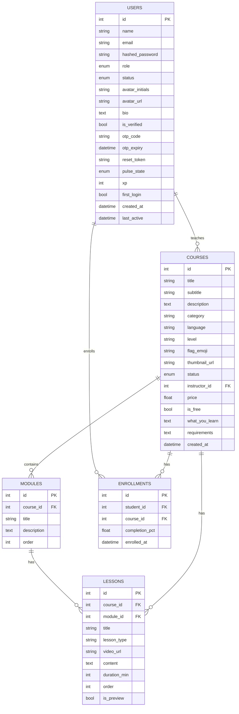
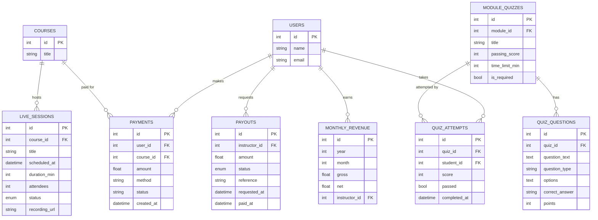
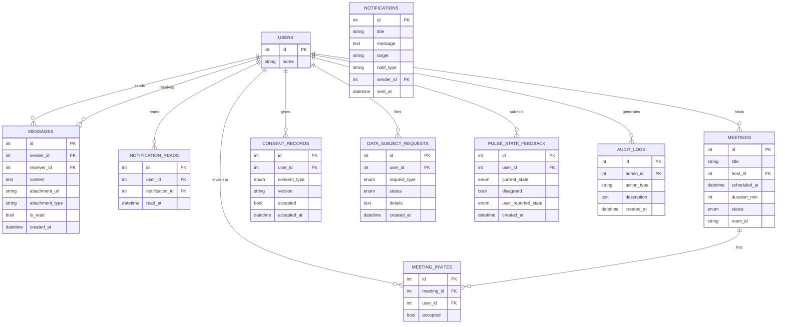
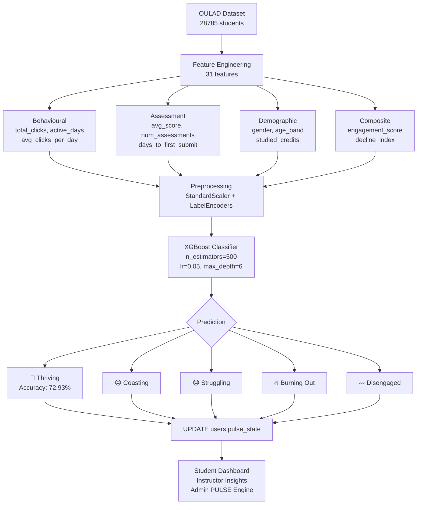
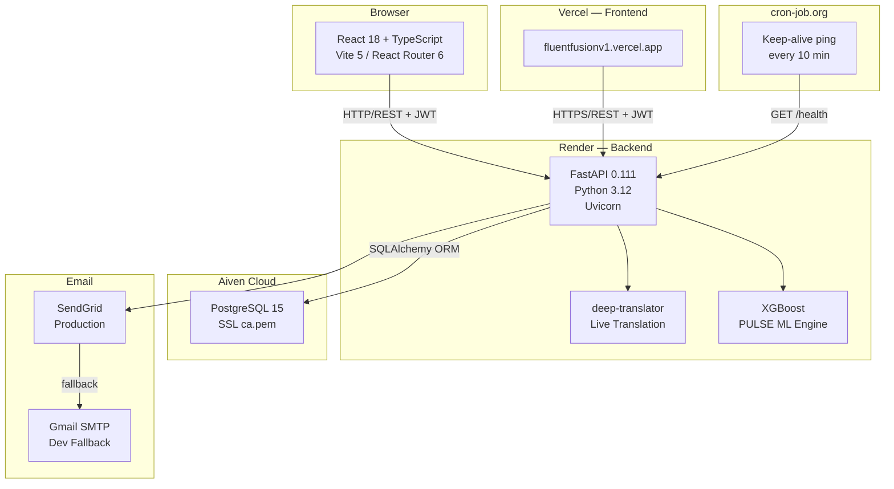
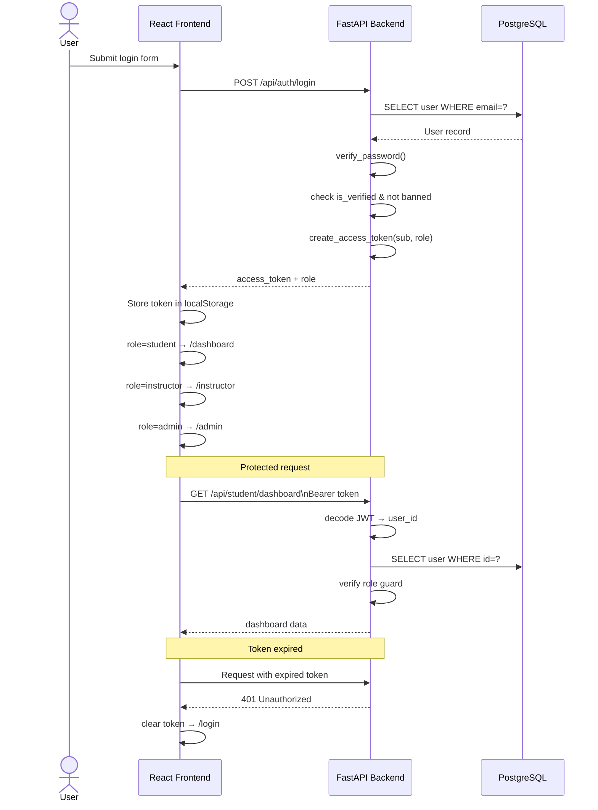
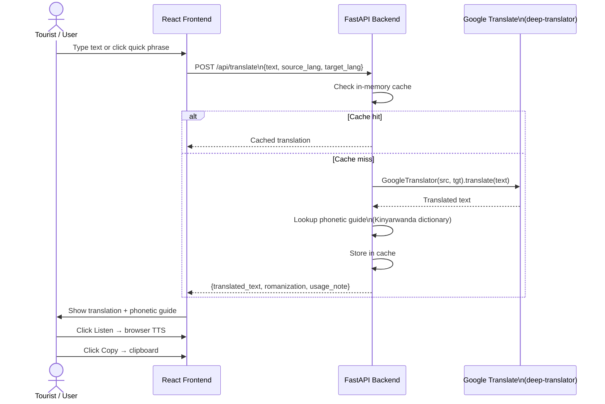

# 📐 FluentFusion — System Diagrams

> Render at [mermaid.live](https://mermaid.live) then export as PNG (1920×1080, scale 2) for Google Docs.
> Insert as image — never paste Mermaid code directly into Google Docs.

---

## 1. 🔄 Flowchart — Full User Journey

```mermaid
flowchart TD
    A([User visits /]) --> B{Logged in?}
    B -- No --> C[Welcome Page]
    B -- Yes --> D{Role?}

    C --> E[/signup]
    C --> F[/login]

    E --> G[Register: name, email, password, role]
    G --> H[OTP sent via Email]
    H --> I[/verify-email — Enter 6-digit OTP]
    I --> J{OTP valid?}
    J -- No --> K[Resend OTP]
    K --> I
    J -- Yes --> L{Role?}

    F --> M[Enter credentials]
    M --> N{Valid?}
    N -- No --> O[Error: Invalid credentials]
    N -- Yes --> P{Email verified?}
    P -- No --> Q[Error: EMAIL_NOT_VERIFIED]
    P -- Yes --> L

    L -- student + first login --> R[Onboarding Step 1: Native Language]
    R --> S[Step 2: Target Language]
    S --> T[Step 3: Goal]
    T --> U[Step 4: Level]
    U --> V[POST /api/student/onboarding]
    V --> W[/dashboard]

    L -- student + returning --> W
    L -- instructor --> X[/instructor]
    L -- admin / super_admin --> Y[/admin]

    D -- student --> W
    D -- instructor --> X
    D -- admin --> Y

    W --> W1[Browse Catalog]
    W --> W2[Live Translation]
    W --> W3[Take Quiz]
    W --> W4[Join Live Session]
    W --> W5[View Leaderboard]

    X --> X1[Create Course]
    X --> X2[Schedule Live Session]
    X --> X3[View PULSE Insights]

    Y --> Y1[Approve Courses]
    Y --> Y2[Manage Users]
    Y --> Y3[Run PULSE Engine]
```

---

## 2a. 👤 Use Case Diagram — Student & Auth



---

## 2b. 👤 Use Case Diagram — Instructor & Admin



---

## 3. 🔁 Sequence Diagram — Registration & Onboarding



---

## 4a. 🗄️ ERD — Core Tables



---

## 4b. 🗄️ ERD — Sessions, Quizzes & Payments



---

## 4c. 🗄️ ERD — Communication & Compliance



---

## 5. 🧠 PULSE ML Pipeline



---

## 6. 🏗️ System Architecture



---

## 7. 🔐 Sequence — JWT Auth & Role Routing



---

## 8. 🌍 Live Translation Flow



---

## Summary

| # | Diagram | What it shows |
|---|---|---|
| 1 | Flowchart | Complete user journey — signup, onboarding, all 3 dashboards |
| 2a | Use Case | Student & Auth actor interactions |
| 2b | Use Case | Instructor, Admin & Super Admin interactions |
| 3 | Sequence | Registration, OTP verification, onboarding |
| 4a | ERD | Core tables: Users, Courses, Modules, Lessons, Enrollments |
| 4b | ERD | Sessions, Quizzes, Payments, Payouts |
| 4c | ERD | Messages, Notifications, Meetings, Ethics & Compliance |
| 5 | ML Pipeline | PULSE: OULAD data → XGBoost → 5 engagement states |
| 6 | Architecture | Full system: Vercel, Render, Aiven, Email, cron-job.org |
| 7 | Sequence | JWT auth, role-based routing, token expiry |
| 8 | Sequence | Live Translation: cache → deep-translator → phonetic guide |
